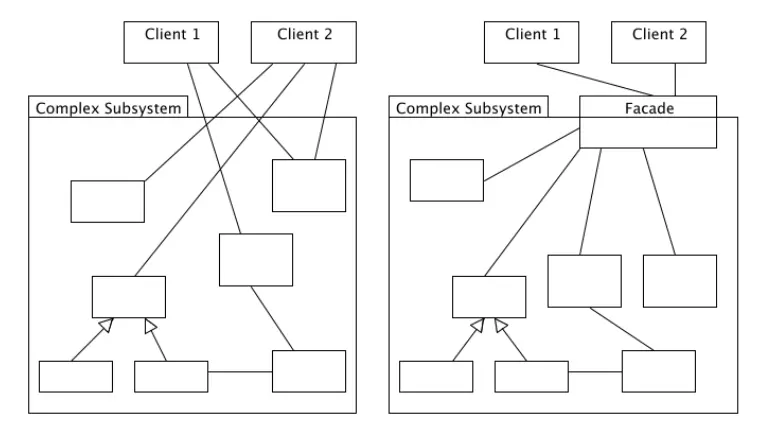

# Architecture Concepts

## Nội dung

| Content                                       |
| :-------------------------------------------- |
| [Vòng đời một request](#vòng-đời-một-request) |
| [Service Container](#service-container)       |
| [Service Provider](#service-provider)         |
| [Facades](#facades)                           |

## More info

### [Vòng đời một request](./request-lifecycle.md)

---

### [Service-container](./service-container.md)

Đây là một công cụ Laravel cung cấp để quản lý các class dependency và tối ưu việc sử dụng dependency injection.

```php
use App\Repositories\UserRepository;
use App\Repositories\UserRepositoryInterface;

$this->app->bind(UserRepositoryInterface::class, UserRepository::class);
```

---

### Service Provider

Service provider chính là điểm mấu chốt trong việc khởi tạo một ứng dụng Laravel. Các server core của laravel hay các service tự tạo đều được bootstrap thông qua service provider.

`bootstrap` (khởi tạo) là việc đăng ký tất cả mọi thứ các service container binding, event listeners, middleware, even routes.

Trong `config/app.php` bao gồi mảng `providers` chứa các service provider sẽ được sử dụng trong trong app laravel của ta.

```php
'providers' => ServiceProvider::defaultProviders()->merge([
  /*
    * Package Service Providers...
    */

  /*
    * Application Service Providers...
    */
  App\Providers\AppServiceProvider::class,
  App\Providers\AuthServiceProvider::class,
  // App\Providers\BroadcastServiceProvider::class,
  App\Providers\EventServiceProvider::class,
  App\Providers\RouteServiceProvider::class,
])->toArray(),
```

---

### Facades

Ứng dụng Facades design pattern trong laravel.



Cung cấp một "static" interface cho các class có sẵn trong service container của ứng dụng.

Tất cả các facades đều có namespace `Illuminate\Support\Facades` và được đăng ký trong `config/app.php` trong mảng `aliases`.

```php
'aliases' => Facade::defaultAliases()->merge([
  // 'Example' => App\Facades\Example::class,
])->toArray(),
```
