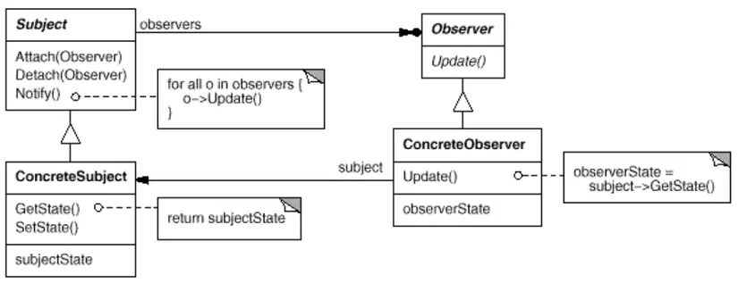

# Digging Deeper

## Nội dung

| Content                                     |
| :------------------------------------------ |
| [Artisan Console](#artisan-console)         |
| [Broadcasting](#broadcasting)               |
| [Cache](#cache)                             |
| [Collections](#collections)                 |
| [Context](#context)                         |
| [Contracts](#contracts)                     |
| [Events](#events)                           |
| [File Storage](#file-storage)               |
| [Helpers](#helpers)                         |
| [HTTP Client](#http-client)                 |
| [Localization](#localization)               |
| [Mail](#mail)                               |
| [Notifications](#notifications)             |
| [Package Development](#package-development) |
| [Processes](#processes)                     |
| [Queues](#queues)                           |
| [Rate Limiting](#rate-limiting)             |
| [Strings](#strings)                         |
| [Task Scheduling](#task-scheduling)         |

## More info

### Artisan Console

`Artisan` là một CLI chứa Laravel, giúp thực hiện các tác vụ như tạo controller, model, migration, seed, event, job, middleware, provider, request, command, event, listener, policy, factory, test,...

Các lệnh thường sử dụng:

```bash
php artisan list
```

> Liệt kê tất cả các lệnh có sẵn.

```bash
php artisan make:[something]
```

> Tạo các service cần thiết

```bash
php artisan migrate:[option]
```

> Migrate và tương tác với database

---

### Broadcasting

`Broadcasting` là một công cụ giúp tạo ra các sự kiện realtime thông qua WebSockets.
Laravel hỗ trợ broadcasting thông qua một số driver như Pusher, Redis, Socket.io, etc,...

---

### Cache

`Cache` là một cơ chế giúp lưu trữ dữ liệu tạm thời để giảm thời gian xử lý request.
Laravel hỗ trợ nhiều driver như file, database, Memcached, Redis, etc,...

Được cấu hình trong `config/cache.php`:

```php
/*
|--------------------------------------------------------------------------
| Default Cache Store
|--------------------------------------------------------------------------
|
| This option controls the default cache connection that gets used while
| using this caching library. This connection is used when another is
| not explicitly specified when executing a given caching function.
|
*/

'default' => env('CACHE_DRIVER', 'file'),
```

```php
$value = Cache::store('file')->get('foo');

Cache::store('redis')->put('bar', 'baz', 600); // 10 Minutes
```

---

### Collections

`Collection` là một class trong Laravel cho phép triển khai ctdl Collection để xử lý dữ liệu một cách dễ dàng và linh hoạt.

```php
$collection = collect([1, 2, 3]);
```

---

### Context

Laravel context cho phép `capture`, `retrieve` và `share` các thông tin trong request.

Ứng dụng điển hình của context được triển khai trong `Logging`:

```php
<?php

namespace App\Http\Middleware;

use Closure;
use Illuminate\Http\Request;
use Illuminate\Support\Facades\Context;
use Illuminate\Support\Str;
use Symfony\Component\HttpFoundation\Response;

class AddContext
{
  /**
   * Handle an incoming request.
   */
  public function handle(Request $request, Closure $next): Response
  {
    Context::add('url', $request->url());
    Context::add('trace_id', Str::uuid()->toString());

    return $next($request);
  }
}
```

```php
Log::info('User authenticated.', ['auth_id' => Auth::id()]);
```

Kết quả nhận được:

```php
User authenticated. {"auth_id":27} {"url":"https://example.com/login","trace_id":"e04e1a11-e75c-4db3-b5b5-cfef4ef56697"}
```

---

### Contracts

Là một tập hợp các interface mà cung cấp các phương thức mà một class cần phải implement.

Khá tương đồng với `Facade` nhưng không phải là một class cụ thể.

Ví dụ: `Illuminate\Contracts\Queue\Queue`:

---

## Events

Một cách triển khai cơ bản của observer pattern trong Laravel.

`Observer pattern` là một design pattern mà một object (subject) giữ dánh sách các thành phần phụ thuộc (observers) và thông báo cho chúng khi có sự thay đổi trạng thái.



Các event sẽ được lưu trữ trong `app/Events`, các listener sẽ được lưu trữ trong `app/Listeners`.

```php
public function processSubmitOrder(Request $request){
    //...lưu thông tin vào đơn hàng..v..vv
    event(new customerOrder($bill));
}
```

---

### File Storage

Laravel cung cấp một cách dễ dàng để lưu trữ file thông qua `File Storage`.

Được cấu hình trong `config/filesystems.php`:

```php
use Illuminate\Support\Facades\Storage;

Storage::disk('local')->put('example.txt', 'Contents');
```

---

### Helpers

Cũng cấp một đống hàm siêu tiện để xử lý dữ liệu,...

---

### HTTP Client

Cho phép gọi request tới các API khác. Là một bản thu nhỏ của [Guzzle HTTP client](https://docs.guzzlephp.org/en/stable/)

```php
use Illuminate\Support\Facades\Http;

$response = Http::get('http://example.com');
```

---

### Localization

Hỗ trợ đa ngôn ngữ trong ứng dụng.

Để khởi tạo sử dụng câu lệnh:

```bash
php artisan lang:publish
```

---

### Mail

Cũng cấp các email API triển khai bởi [Symfony Mailer](https://symfony.com/doc/current/mailer.html), dễ dàng trong việc gửi mail.

Được cấu hình trong thư mục `config/mail.php`

```php
class OrderShipmentController extends Controller
{
  /**
   * Ship the given order.
   */
  public function store(Request $request): RedirectResponse
  {
    $order = Order::findOrFail($request->order_id);

    // Ship the order...

    Mail::to($request->user())->send(new OrderShipped($order));

    return redirect('/orders');
  }
}
```

---

### Notifications

Laravel cũng cung cấp một cách dễ dàng để gửi thông báo thông qua nhiều kênh khác nhau như email, SMS, Slack, etc,...

```php
use Illuminate\Support\Facades\Notification;

Notification::send($users, new InvoicePaid($invoice));
```

---

### Package Development

Cho phép tạo ra các package riêng biệt và sử dụng chúng trong ứng dụng.

---

### Processes

Là một bản thu nhỏ của [Symfony Process Component](https://symfony.com/doc/current/components/process.html) giúp thực thi các command line trong ứng dụng laravel.

```php
use Illuminate\Support\Facades\Process;

$result = Process::run('ls -la');

return $result->output();
```

---

### Queues

Là một cơ chế giúp xử lý các công việc nặng nề mà không ảnh hưởng đến response của ứng dụng.

Được config trong `config/queue.php`:

---

### Rate Limiting

Giúp giới hạn số lượng request mà một user có thể thực hiện trong một khoảng thời gian nhất định.

```php
use Illuminate\Support\Facades\RateLimiter;

if (RateLimiter::tooManyAttempts('send-message:'.$user->id, $perMinute = 5)) {
    return 'Too many attempts!';
}

RateLimiter::increment('send-message:'.$user->id);

// Send message...
```

---

### Strings

Một đống phương thức giúp xử lý chuỗi trong laravel.

---

### Task Scheduling

Triển khai cron job trong laravel

```php
Schedule::call(function () {
    DB::table('recent_users')->delete();
})->daily();
```
